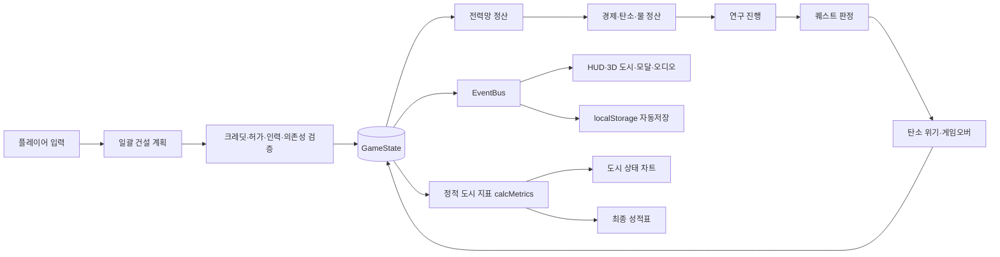

# AI 시티를 구하라! — 게임 시스템 종합 점검

- 점검일: 2026-08-31
- 대상: `AI_City_Webgame_V3`의 현재 로컬 코드(커밋되지 않은 변경 포함)
- 범위: 성장, 퀘스트, 경제, 전력, 환경, 인구·인력, 연구, 저장, 실패·복구, 최종 평가, 아키텍처, 성능, QA, 수익화 준비도
- 방식: 코드 정적 분석, 실제 계산기 교차 실행, 프로덕션 빌드, Playwright 단위·브라우저 통합 테스트

## 1. 한눈에 보는 결론

이 게임은 **플레이 가능한 교육용 도시 운영 시뮬레이션으로서 뼈대가 강하다.** 특히 일괄 건설의 원자성, 전력 우선순위, 인구·인력 하드 게이트, 병렬 연구, 자동저장, 탄소 실패 조건, 3D 렌더링 성능은 잘 설계되어 있다.

가장 큰 문제는 콘텐츠 양이 아니라 **규칙의 단일성**이다. 현재 도시는 두 종류의 계산기를 동시에 쓴다.

1. `BoardSystem.calcMetrics()` — 도시 상태 차트와 최종 성적표에 쓰는 정적 설계 점수
2. `PowerNetworkSystem + EconomySystem` — 시간당 크레딧, 전력, 탄소, 물, 퀘스트, 게임오버에 쓰는 실시간 운영값

두 계산기는 같은 시설의 레벨, 녹지, 냉각 인접, 저장장치 연결을 다르게 해석한다. 따라서 플레이어가 화면에서 배운 규칙과 실제 퀘스트·탄소 위기·최종 점수가 서로 어긋날 수 있다. 이 부분이 성장 콘텐츠를 더 추가하기 전에 먼저 정리해야 할 핵심이다.

| 영역 | 점검 결과 | 요약 |
| --- | ---: | --- |
| 아키텍처 | 4/6 | 핵심 싱글턴과 계층은 있으나 규칙 중복과 직접 결합이 큼 |
| 성능 | 4/5 | 3D 렌더링은 매우 우수, 앱 전체 teardown은 부분적 |
| 코드 품질 | 3/4 | 순환 의존성 0개, 대형 모듈과 책임 중복이 남음 |
| 수익화 준비 | 1/4 | 점수는 있으나 세션·검증·Play.fun 연동 없음 |
| 현재 검증 | 통과 | 빌드, 단위 155개, 선택 브라우저 통합 41개 통과 |

## 2. 현재 게임 시스템 지도



핵심 시간 흐름은 `SimulationSystem.createHourSettler()`에서 다음 순서로 고정되어 있다.

1. 연구 추가 전력 수요 반영
2. 전력망 배분 및 배터리 충·방전
3. 시간당 경제·탄소·물 정산
4. 연구 진행
5. 퀘스트 조건 판정
6. 탄소 위기 누적·회복·게임오버 판정
7. 상태 저장 이벤트와 UI 갱신

이 순서는 합리적이며 단위 테스트로도 고정되어 있다.

## 3. 핵심 플레이 루프

### 짧은 루프: 수초 단위

`시설 선택 → 여러 칸에 계획 배치 → 예상 운영값 확인 → 일괄 확정 → 시간당 결과 확인`

- 계획은 확정 전까지 저장되지 않는 임시 상태다.
- 비용, 시설 허가, 원전의 화력 예비력, 최종 인력 수급 중 하나라도 실패하면 전체 계획이 취소된다.
- 적자가 더 악화되는 건설은 추가 확인 모달을 거친다.
- 건설, 강화, 철거는 각각 비용과 인력 조건을 다시 검증한다.

### 중간 루프: 퀘스트 단위

`시설 해금 → 운영 조건 달성 → 보상 수령 → 다음 시설·허가·연구 해금`

- 총 15개 선형 퀘스트다.
- 시설 해금과 Lv.2/Lv.3 도시 허가를 퀘스트에 묶었다.
- 일부 퀘스트는 배치 즉시 완료되고, 일부는 2~4시간 연속 운영을 요구한다.
- 퀘스트 4 이후 데이터센터 연구가 열린다.
- 퀘스트 5 이후 탄소 위기가 활성화된다.
- 퀘스트 6 완료 시 보드가 19칸에서 37칸으로 확장된다.

### 장기 루프: 캠페인 단위

`화력 기반 도시 → 핵발전 전환 → 물순환 → 태양광·저장 → 풍력 → 폭염·야간 대응 → 저탄소 도시 → 최종 퀴즈·성적표`

교육적 인과 사슬은 분명하다. 다만 후반의 선택 연구와 Lv.3 성장이 필수 퀘스트에 연결되지 않아 장기 성장의 마지막 고리가 약하다.

## 4. 성장 시스템 분석

### 4.1 시설 해금 순서

| 시점 | 새로 열리는 요소 |
| --- | --- |
| 시작 | 주거지 |
| 퀘스트 1 보상 | 공장, 화력발전 |
| 퀘스트 2 보상 | 녹지 |
| 퀘스트 3 보상 | 데이터센터 |
| 퀘스트 4 보상 | 핵발전, 연구 메뉴 |
| 퀘스트 5 보상 | 순환냉각 |
| 퀘스트 6 보상 | 태양광, 37칸 보드 확장 |
| 퀘스트 7 보상 | 에너지저장, 도시 Lv.2 강화 허가 |
| 퀘스트 8 보상 | 풍력 |
| `조력 발전 실증` 연구 | 조력발전 |
| 퀘스트 13 보상 | 도시 Lv.3 강화 허가 |

시설 해금 순서는 교육 흐름과 잘 맞는다. 초반에 주거·생산·전력을 한 묶음으로 배우고, 중반부터 저탄소·저장·냉각으로 확장한다.

### 4.2 시설 성장

- 대부분 시설은 Lv.1~3이다. 녹지는 Lv.1 고정이다.
- Lv.2 출력 배율은 1.48, Lv.3은 1.92다.
- 수요 배율은 1.24, 1.45다.
- 양의 환경 부담 배율은 1.16, 1.30이다.
- 환경 저감 효과 배율은 1.35, 1.65다.
- 강화 비용은 Lv.1→2가 기본 건설비 100%, Lv.2→3이 145%다.
- 철거 환급은 누적 투자비의 50%를 내림한 값이다.

문제는 이 배율 중 상당수가 `calcMetrics()`에만 적용되고 실시간 경제에는 적용되지 않는다는 점이다. 예를 들어 발전 시설의 실제 시간당 탄소·물은 레벨이 올라도 그대로다. 공장·데이터센터의 시간당 수입도 레벨에 따라 증가하지 않는다. 성장의 비용은 커지지만 보상의 일부는 정적 발전점수에만 남는다.

### 4.3 연구 성장

| 연구 | 비용 | 기본 시간 | 1× 실제 시간 | 결과 |
| --- | ---: | ---: | ---: | --- |
| 고효율 태양전지 | 10 | 120h | 2분 | 태양광 기술 Lv.2 |
| 풍력 예측 제어 | 10 | 120h | 2분 | 풍력 기술 Lv.2 |
| 차세대 저장 화학 | 15 | 150h | 2분 30초 | 배터리 기술 Lv.2 |
| 조력 발전 실증 | 18 | 150h | 2분 30초 | 조력 기술 Lv.1·시설 해금 |
| 통합 재생전력망 | 24 | 180h | 3분 | 태양광·풍력·조력 기술 Lv.3 |

- 데이터센터 한 곳은 연구 하나만 맡는다.
- 데이터센터가 여러 개면 연구를 병렬 진행할 수 있다.
- 연구 중 데이터센터 수요가 +2E 증가한다.
- 전력 공급률이 90% 미만이면 해당 연구만 멈춘다.
- 데이터센터 Lv.2/Lv.3은 연구 속도를 1.25배/1.5배로 높인다.
- 각 연구 퀴즈의 정답 하나는 연구 시간 25%를 즉시 단축한다.

연구는 전력망과 데이터센터 성장을 연결한 좋은 메타 시스템이다. 그러나 현재 `통합 재생전력망` 결과에 배터리 Lv.3이 빠져 있어 배터리 Lv.3은 도달 불가능하다.

### 4.4 후반 성장의 활용도

필수 캠페인에서 실제로 요구하는 연구는 태양광 Lv.2와 풍력 Lv.2뿐이다.

- `차세대 저장 화학`은 선택 사항이다.
- `조력 발전 실증`과 조력발전은 선택 사항이다.
- `통합 재생전력망`은 선택 사항이다.
- 퀘스트 13에서 Lv.3 허가를 얻지만 퀘스트 14·15는 Lv.3 시설이나 통합 연구를 요구하지 않는다.

따라서 후반부에 가장 비싼 연구와 마지막 성장 허가를 얻어도, 캠페인이 그것을 사용하게 만들지 않는다. **성장 보상은 존재하지만 성장의 시험대가 없는 상태**다.

## 5. 퀘스트 시스템 분석

아래 표는 문구가 아니라 현재 코드가 실제로 판정하는 조건을 기준으로 작성했다.

| Lv | 실제 완료 조건 | 보상 | 점검 메모 |
| ---: | --- | --- | --- |
| 1 | 주거지 2개 | 4, 공장·화력 해금 | 명확한 첫 행동 |
| 2 | 공장·화력 인접 + 공장 전력·가동률 50% 이상 + 수입 발생 2시간 | 5, 녹지 해금 | 배치와 첫 운영 흑자를 함께 학습 |
| 3 | 녹지 1칸 | 6, 데이터센터 해금 | 환경 시설을 직접 사용하게 함 |
| 4 | 데이터센터 전력 90% 이상 2시간 | 8, 핵발전·연구 해금 | 이 시점 도시를 물 기준선으로 저장 |
| 5 | 핵발전 보유, 저탄소 40% 이상, CO₂ 12 이하, 흑자 2시간 | 8, 냉각 해금 | 이후 탄소 위기 활성화 |
| 6 | 데이터센터·냉각 인접, 둘 다 전력 90%, 물 사용 기준 이하 2시간 | 14, 태양광·보드 확장 | 물순환 학습의 핵심 |
| 7 | 태양광이 실제 전력 공급, 저탄소 30% 이상 2시간 | 6, 배터리·Lv.2 허가 | 실시간 경로를 검사함 |
| 8 | 태양광 연구 완료 + 태양광 Lv.2 | 8, 풍력 해금 | 연구·강화 결합 |
| 9 | 배터리 경로의 저탄소 전력 누적 8E | 8 | 실제 코드는 시간 조건 없음 |
| 10 | 풍력 연구 완료 + 풍력 Lv.2 | 10 | 연구·강화 반복 |
| 11 | 주거지·녹지 인접 + 흑자 3시간 | 10 | 생활권·경제 결합 |
| 12 | 폭염 중 모든 필수시설 전력 90% 이상 3시간 | 10 | 우선순위 운영 시험 |
| 13 | 19~23시, 공급≥수요, 저장량 5E 이상 3시간 | 12, Lv.3 허가 | 시간대·저장 시험 |
| 14 | 저탄소 70%, 물 사용 기준 미만, 흑자 4시간 | 14 | 종합 운영 시험 |
| 15 | 최종 퀴즈 4개 중 3개 이상 정답 | 최종 성적표 | 운영 결과보다 지식 확인 중심 |

### 퀘스트 설계의 강점

- 초반 행동이 구체적이고 해금 순서가 자연스럽다.
- 배치, 시간당 운영, 연구, 저장, 기후 사건을 단계적으로 소개한다.
- 단순 보유가 아니라 실제 전력 경로와 공급률을 보는 퀘스트가 있다.
- 연속 시간 조건은 조건을 잃으면 0으로 초기화되어 꼼수를 줄인다.
- 긴 캠페인 중 돈이 1 이하가 되면 퀘스트당 한 번 +4 긴급 지원을 받을 수 있다.

### 퀘스트 설계의 약점

1. 퀘스트 9 제목은 `7칸 저장 허브`지만 실제 판정에는 7칸 조건이 없다.
2. 퀘스트 9는 테스트 이름상 3시간을 암시하지만 실제 완료는 8E만 채우면 된다. 현재 달성 가능성 테스트도 한 번의 정산으로 완료시킨다.
3. 퀘스트 14는 Lv.3 허가 직후지만 Lv.3 또는 최종 연구를 요구하지 않는다.
4. 마지막 퀘스트는 도시 운영의 최종 선택보다 일반 퀴즈에 가깝다.
5. 퀘스트 달성 가능성 테스트는 퀘스트별로 500 크레딧과 완성된 도시를 따로 주입한다. 처음 10 크레딧에서 15단계까지 이어지는 실제 연속 플레이의 무소프트락을 증명하지는 않는다.

## 6. 경제·자원 시스템 분석

### 6.1 크레딧

시간당 순수익은 대략 다음 구조다.

`시설 수입 - 유지비 - 과밀 비용 - 오염 건강 비용 - 탄소 회복 비용`

- 주거 수입은 전력, 고용률, 오염 인접에 영향을 받는다.
- 공장·데이터센터 수입은 전력과 인력 충족률에 영향을 받는다.
- 전력 공급률 25% 미만이면 해당 수요 시설은 정지한다.
- 같은 시설은 3개까지 과밀 비용이 없고, 그 이후부터 시설 비용에 비례한 부담이 붙는다.
- 공장·화력과 주거의 인접 쌍마다 건강 비용 0.4가 붙고 주거세가 절반으로 줄어든다.
- 시간당 CO₂가 8을 넘으면 초과분의 25%가 탄소 회복 비용으로 빠진다.
- 보유 크레딧은 0 아래로 내려가지 않아 부채는 없다.
- 15개 퀘스트의 고정 보상 총액은 123이며 초기 10을 더하면 정산 수입 전 총 133이다.

경제는 시설 수보다 **전력·인력·배치의 질**을 보게 만든다는 점이 좋다. 반면 시설 강화가 시간당 수입을 직접 높이지 않아 생산 시설의 레벨업 체감이 약하다.

### 6.2 인구·인력

- 주거지는 Lv.1/2/3에서 인구 10/15/22를 공급한다.
- 다른 시설은 종류와 레벨에 따라 0~9명을 사용한다.
- 일괄 건설은 계획 최종 상태의 인구와 사용 인력을 한 번에 검증한다.
- 강화나 주거 철거로 인력 부족이 악화되면 행동을 막는다.
- 기존 저장이 이미 인력 부족이어도 부족분을 줄이는 복구 행동은 허용한다.

이 시스템은 소프트락 방지와 UX가 모두 좋다. 현재 게임에서 가장 완성도가 높은 성장 제약 중 하나다.

### 6.3 전력망

- 발전원: 화력, 핵, 태양광, 풍력, 조력
- 소비 우선순위: 필수 → 일반 → 절약
- 한 칸을 넘는 직접 송전은 추가 칸마다 효율이 6% 감소하고 최소 55%를 유지한다.
- 소비 시설과 인접한 배터리는 95% 효율의 허브로 작동한다.
- 태양광은 시간대, 풍력은 결정적 4틱 패턴에 따라 발전량이 달라진다.
- 배터리는 저탄소·화석 저장량을 따로 추적한다.

전력망은 교육적이고 테스트도 충실하다. 다만 정적 도시 지표는 태양광·풍력이 배터리와 직접 인접해야 안정성이 높아지는 것으로 계산하는 반면, 실시간 전력망은 **배터리가 소비 시설에 인접하면 먼 발전원도 허브로 받을 수 있다.** 배치 안내와 실제 운영 규칙이 완전히 같지 않다.

### 6.4 탄소 위기

- 퀘스트 5 완료 뒤 활성화된다.
- 시간당 CO₂가 8보다 높으면 위험 시간이 시간당 1 증가한다.
- 8 이하이면 시간당 2 회복한다.
- 24/72/144시간에 한 번씩 경고한다.
- 168시간 누적 시 게임오버다.

게임 한 시간은 1×에서 현실 1초이므로, 계속 위험한 도시는 1×에서 2분 48초, 4×에서 42초 만에 게임오버가 된다. 4× 플레이에서 경고는 약 6초, 18초, 36초 시점에 온다. 교육용 수업에서는 원인 파악 전에 실패했다고 느낄 수 있으므로 실제 학생 플레이 시간으로 재조정할 필요가 있다.

## 7. 가장 중요한 시스템 불일치

### 7.1 정적 도시 점수와 실시간 운영값이 다른 규칙을 쓴다 — 심각도: 매우 높음

근거:

- 정적 계산: `src/systems/BoardSystem.js:102-173`
- 실시간 계산: `src/systems/EconomySystem.js:23-88`
- 퀘스트·탄소 위기는 실시간 값을 사용한다.
- 도시 레이더 차트·최종 성적표는 정적 값을 사용한다.

확인한 차이:

| 규칙 | 정적 `calcMetrics` | 실시간 `settleEconomy` |
| --- | --- | --- |
| 시설 레벨 탄소·물 배율 | 적용 | 미적용 |
| 데이터센터·냉각 인접 물 절감 | 적용 | 인접 여부 무시 |
| 핵발전·냉각 인접 물 절감 | 적용 | 인접 여부 무시 |
| 냉각 시설의 -5 물 효과 | 인접 보너스와 함께 계산 | 도시 어디에 있어도 적용 |
| 녹지의 -1 탄소 | 적용 | 음의 탄소를 0으로 잘라 미적용 |
| 공장·데이터센터 레벨별 수입 성장 | 정적 발전점수만 증가 | 시간당 수입 증가 없음 |
| 재생에너지·배터리 연결 | 직접 인접 중심 | 소비지 인접 허브 중심 |

실제 교차 실행 예시:

- 화력+주거 도시에서 화력을 Lv.1→Lv.3으로 올리면 정적 탄소는 9→11.4로 변하지만 실시간 탄소는 8→8로 그대로다.
- 데이터센터·핵·냉각이 인접한 도시의 정적 물은 0이지만 실시간 물은 6이다.
- 냉각을 떨어뜨려도 실시간 물은 여전히 6이다.
- 녹지를 추가하면 정적 탄소는 변하지만 실시간 탄소 위기 값은 변하지 않는다.

영향:

- 플레이어가 차트, 퀘스트, 탄소 경고, 최종 점수에서 서로 다른 답을 본다.
- “냉각을 인접시키면 물을 줄인다”는 핵심 교육 목표가 실시간 물 계산에서는 성립하지 않는다.
- 강화의 환경 비용과 편익이 퀘스트에서 왜곡된다.
- 밸런스 조정 시 한 계산기만 고치면 다른 화면이 다시 어긋난다.

권장 방향:

시설별 한 시간 운영 결과를 계산하는 단일 함수 또는 단일 도메인 모델을 만들고, 정적 미리보기·실시간 정산·퀘스트·차트·성적표가 같은 결과를 소비하도록 해야 한다.

### 7.2 배터리 Lv.3이 도달 불가능하다 — 심각도: 높음

- `BoardSystem.validateUpgrade()`는 배터리 Lv.3에 배터리 기술 Lv.3을 요구한다.
- `battery2` 연구는 배터리 기술을 Lv.2로 만든다.
- 최종 `renewable3` 연구는 태양광·풍력·조력만 Lv.3으로 만들고 배터리를 제외한다.
- 실제 코드로 모든 연구 완료·Lv.3 도시 허가 상태를 구성해도 배터리 Lv.2→3은 `technology_required`로 거절됐다.

시설이 `maxLevel: 3`이고 UI도 최종 연구를 안내하므로, 의도된 막힘이 아니라 성장 트리 누락으로 보는 것이 타당하다.

### 7.3 일반 초기화가 실제 시뮬레이션 배속을 초기화하지 않는다 — 심각도: 높음

`main.js:268-274`의 일반 초기화는 `gameState.reset()`만 실행하고 `simulationController.setTimeScale()`을 호출하지 않는다. 게임오버 초기화 경로는 이 호출을 한다.

브라우저 재현 결과:

```json
{
  "before": { "state": 4, "controller": 4 },
  "after": { "state": 1, "controller": 4 },
  "quest": 1
}
```

화면 상태는 1×로 표시하지만 실제 정산은 4×로 계속된다. 일시정지 상태에서 초기화하면 컨트롤러의 `player` pause reason도 남을 가능성이 있다. 또한 `GAME_RESET` 이벤트를 보내지 않아 퀘스트 알림 상태를 지우는 기존 리스너도 실행되지 않는다.

### 7.4 최종 자율성 점수가 오답 연구 퀴즈를 보상한다 — 심각도: 높음

- 연구 퀴즈의 `passThreshold`는 0이다.
- 0/4 정답으로 끝내도 결과가 `passed: true`다.
- 최종 성적표는 `passed`인 모든 퀴즈마다 자율성 +7을 준다.
- 최종 보고서 시점에는 퀘스트 15개 완료가 이미 자율성 80점을 보장한다.
- 최종 퀴즈 통과로 87점, 연구 퀴즈 두 개를 정답 없이 완료해도 상한 100점에 도달할 수 있다.

실제 확인 결과:

```json
{"done":true,"passed":true,"correct":0,"total":4,"passThreshold":0,"researchId":"solar2"}
```

최종 `autonomy`는 정답률, 선택의 질, 운영 회복력 중 무엇을 평가하는지 다시 정의해야 한다.

### 7.5 최종 성적표가 표시하는 운영 기록을 총점에 거의 반영하지 않는다 — 심각도: 중간~높음

보고서는 평균 순수익, 송전 효율, 저탄소 비율, 고용률, 정전 시간, 과밀·건강 비용을 계산해 보여준다. 그러나 총점은 정적 지속가능성, 정적 공간 시너지, 거의 고정된 자율성, 발전점수로 계산된다.

즉, 운영 기록은 결과 화면에 보이지만 총점의 직접 입력은 아니다. 퀘스트 14까지 같은 도시를 만든 두 플레이어가 서로 다른 정전·적자 이력을 가져도 최종 점수 차이가 작거나 없을 수 있다.

### 7.6 후반 성장 보상이 메인 퀘스트에서 사용되지 않는다 — 심각도: 중간

Lv.3 허가, 배터리 연구, 조력 연구, 통합 재생전력망은 존재하지만 마지막 종합 퀘스트가 이를 요구하지 않는다. 후반 성장의 선택성을 유지하려면 최종 평가에 반영하고, 필수 성장으로 만들려면 퀘스트 14 조건에 최소 하나를 연결하는 식의 명확한 역할이 필요하다.

## 8. 아키텍처 리뷰 — 4/6

| 항목 | 판정 | 근거 |
| --- | --- | --- |
| EventBus | 부분 | 중앙 버스와 이벤트 상수는 있으나 UI가 시스템 함수를 직접 호출하고 시스템끼리 직접 import함 |
| GameState | 통과 | 상태·직렬화·복구가 중앙 싱글턴에 모여 있음 |
| Constants | 부분 | 주요 수치는 중앙화됐지만 퀘스트 번호, 시간·임계값, 보고서 15 등 중복된 매직 값이 남음 |
| Orchestrator | 통과 | `main.js`가 부팅, 정산, UI, 테스트 훅을 조정함 |
| Directory Structure | 통과 | `core/systems/ui/audio/level/assets` 계층이 분명함 |
| Event Constants | 통과 | `domain:action` 이벤트 상수를 사용함 |

추가 정적 분석:

- JS 파일 60개
- 정적 import 간선 204개
- 순환 의존성 0개
- 계층 간 import 159개

순환이 없는 것은 좋지만 계층 간 직접 의존이 많다. 특히 `main.js` 544줄, `CityScene3D.js` 1,507줄, `Constants.js` 550줄은 변경 영향 범위가 크다.

## 9. 성능 리뷰 — 4/5

| 항목 | 판정 | 근거 |
| --- | --- | --- |
| Delta time 안전성 | 통과에 준함 | 이동 누적 대신 절대 시각 기반 모션과 dirty rendering을 써 death spiral 위험이 낮음 |
| Object pooling | 통과 | 시설·타일·연기·상태등·새·로터를 InstancedMesh/공유 풀로 재사용 |
| Resource disposal | 통과 | 3D 씬, 카메라, 환경, geometry, material, renderer disposer가 있음 |
| Event cleanup | 부분 | 3D 씬과 일부 컨트롤러는 정리하나 앱 전체 init 함수는 통합 disposer가 없음 |
| Asset loading | 통과 | 진행 수 표시, 캐시, 폴백, 실패 이벤트가 있음 |

브라우저 성능 테스트에서 확인한 계약:

- WebGL 컨텍스트 1개
- 대표 37칸 도시 24 draw calls 이하
- 안정 상태의 연속 렌더 제출 0
- 미리보기 30회 후 WebGL buffer 생성/삭제 0/0
- HUD 전환 30회 후 WebGL buffer 생성/삭제 0/0

프로덕션 빌드:

- HTML 12.16KB, gzip 3.32KB
- CSS 69.62KB, gzip 14.26KB
- JS 1,083.71KB, gzip 316.24KB
- 500KB 초과 청크 경고가 남아 있어 초기 로딩 최적화 여지는 있다.

## 10. 코드 품질 리뷰 — 3/4

| 항목 | 판정 | 메모 |
| --- | --- | --- |
| 순환 의존성 없음 | 통과 | 정적 분석에서 0개 |
| 단일 책임 | 미통과 | 정적·실시간 규칙 중복, 대형 렌더러·오케스트레이터·모달 모듈 |
| 오류 처리 | 통과 | EventBus 핸들러 격리, 저장·에셋 실패 폴백, Web Audio 안전 처리 |
| 일관된 명명 | 통과 | PascalCase 파일과 `domain:action` 이벤트를 대체로 준수 |

추가로 오래된 `DiagnosisSystem`과 관련 상태·테스트가 현재 제품 흐름에서 제거됐지만 코드에는 남아 있다. 즉시 버그는 아니지만 유지보수 시 실제 사용 시스템과 레거시 시스템을 혼동할 수 있다.

## 11. 저장·복구 분석

강점:

- localStorage 자동저장
- 일반 변경은 600ms debounce
- 연속 시뮬레이션은 최대 10초 간격 저장
- 저장 버전 1→5 마이그레이션
- 구형 사각 보드를 육각 보드로 변환
- 연구 Set, 배터리 에너지 구성, 퀘스트·시간 상태 보존
- 미확정 건설 계획은 의도적으로 저장하지 않음

주의점:

- 저장은 브라우저 로컬 단일 슬롯이다.
- 내보내기/가져오기, 다중 슬롯, 클라우드 동기화가 없다.
- 저장값과 `window.__GAME_STATE__`가 클라이언트에 완전히 노출되어 점수 검증에는 사용할 수 없다.
- 일반 초기화의 컨트롤러 상태 불일치가 저장 직후 다시 기록될 수 있다.

## 12. 수익화 준비도 — 1/4

| 항목 | 판정 | 메모 |
| --- | --- | --- |
| 점수·포인트 | 통과 | 발전점수와 최종 성적표 총점이 있음 |
| 세션 추적 | 미통과 | session id, 시작·종료 기록 없음 |
| 안티치트 기반 | 미통과 | 상태와 점수가 전부 클라이언트 조작 가능 |
| Play.fun | 미통과 | SDK와 포인트 이벤트 연동 없음 |

교육용 교실 게임으로는 문제없지만 경쟁 점수·보상·수익화를 붙이려면 서버 검증 가능한 세션 이벤트가 먼저 필요하다.

## 13. QA 현황과 사각지대

### 이번 점검에서 새로 실행한 결과

- `npm run build`: 통과
- `npm test -- --reporter=line --retries=0 tests/e2e/unit`: **155/155 통과**
- 게임·퀘스트 UI·연구 UI·성능 선택 통합: **41/41 통과**
- 브라우저 수동 프로브: 일반 초기화의 상태 1×/컨트롤러 4× 불일치 재현
- 계산기 교차 프로브: 정적·실시간 탄소/물 불일치 재현
- 연구 퀴즈 프로브: 0/4 정답의 `passed: true` 재현

### 현재 테스트가 잘 잡는 것

- 15개 퀘스트의 개별 조건 달성 가능성
- 시설 허가, 인구·인력, 원전 예비력, 철거 안전
- 병렬 연구와 전력 부족 정지
- 배터리 경로와 전력 우선순위
- 저장 마이그레이션
- 3D 성능과 GPU 자원 재사용
- 데스크톱·모바일 UI 핵심 흐름

### 추가해야 할 회귀 테스트

1. 같은 도시에서 정적 지표와 실시간 운영값의 규칙 일치
2. 모든 `maxLevel` 시설의 실제 Lv.3 도달 가능성
3. 일반 초기화 후 GameState·컨트롤러·HUD 배속 일치
4. 연구 퀴즈 정답률과 최종 점수의 의미 일치
5. 초기 10 크레딧에서 시작하는 1→15 연속 캠페인 무소프트락 플레이스루
6. Lv.1/2/3별 수입·탄소·물·인력·전력의 기대 성장 곡선
7. 최종 운영 기록을 바꿨을 때 최종 점수가 의도대로 달라지는지

## 14. 잘 작동하는 부분

- **일괄 건설**: 중간 순서에 상관없이 최종 도시를 검증하고 한 번에 커밋한다.
- **소프트락 방지**: 인력 부족 악화 금지, 긴급 지원, 적자 건설 추가 확인, 원전 예비력 보존이 있다.
- **전력 교육성**: 공급 우선순위, 거리 손실, 변동 발전, 저장 에너지 구성을 실제 경로로 계산한다.
- **연구 운영성**: 데이터센터별 독립 연구, 전력 부족 정지, 재배정, 퀴즈 가속이 자연스럽게 연결된다.
- **퀘스트 온보딩**: 첫 7단계가 시설과 운영 개념을 점진적으로 소개한다.
- **저장 안정성**: 다단계 마이그레이션과 자동저장이 수업 중 새로고침 사고를 잘 방어한다.
- **3D 성능**: 하나의 WebGL 컨텍스트, instancing, dirty rendering, 풀링, DPR 상한이 실제 테스트로 고정되어 있다.
- **에이전트 테스트 계약**: `render_game_to_text()`와 `advanceTime(ms)`가 노출되어 자동 QA가 쉽다.

## 15. 권장 수정 순서

1. **운영 규칙의 단일 소스 확정**  
   탄소·물·레벨·인접·배터리 규칙을 하나의 계산 경로로 통합한다.

2. **성장 트리 완결**  
   배터리 Lv.3 누락을 해결하고, Lv.3·조력·통합 연구를 선택 성장으로 둘지 필수 성장으로 둘지 결정한다.

3. **초기화 원자성 보장**  
   상태, 타이머, 알림, 모달, 오디오, 임시 계획을 하나의 reset lifecycle로 묶고 1×/0×/4×에서 검사한다.

4. **최종 점수 재정의**  
   운영 평균, 정전, 탄소 위험, 퀴즈 정답률이 총점에 어떤 비율로 들어가는지 명시한다.

5. **퀘스트 9와 후반 퀘스트 정리**  
   `7칸`의 의미, 시간 조건, 최종 연구·Lv.3 활용 여부를 문구와 코드에서 일치시킨다.

6. **연속 캠페인 밸런스 테스트 추가**  
   퀘스트별 500 크레딧 fixture가 아니라 실제 보상·수익·비용을 이어가는 자동 플레이스루를 만든다.

7. **아키텍처 경계 축소**  
   `main.js`, `CityScene3D.js`, 정적/실시간 규칙을 작은 책임 단위로 나누고 UI의 직접 상태 변이를 줄인다.

## 16. 최종 판정

현재 버전은 **“기능과 성능은 강하지만, 성장·환경 규칙의 의미 일관성이 출시 전 핵심 점검 대상인 상태”**다.

새 퀘스트나 시설을 더 넣기 전에 다음 네 가지를 먼저 고치는 것이 효과가 가장 크다.

1. 정적 지표와 실시간 운영값 통합
2. 배터리 Lv.3 성장 경로 복구
3. 초기화 배속 불일치 해결
4. 최종 점수의 퀴즈·운영 기록 반영 방식 수정

이 네 항목이 정리되면 현재 15단계 캠페인, 연구, 탄소 위기, 인구·인력 시스템은 상당히 견고한 기반이 된다.
